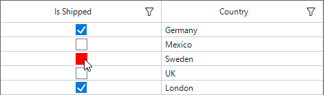

# How to set UncheckedHoverBack color in GridCheckBoxColumn of WinForms DataGrid (SfDatGrid)?

## About the sample
This example illustrates how to set UncheckedHoverBack color in GridCheckBoxColumn of [WinForms DataGrid](https://www.syncfusion.com/winforms-ui-controls/datagrid) (SfDatGrid)?

[WinForms DataGrid](https://www.syncfusion.com/winforms-ui-controls/datagrid) (SfDataGrid) does not provide the direct support to set the **UncheckedHoverBackColor** and **UncheckedHoverBorderColor** in [GridCheckBoxColumn](https://help.syncfusion.com/cr/windowsforms/Syncfusion.WinForms.DataGrid.GridCheckBoxColumn.html). You can get the **UncheckedHoverBackColor** and **UncheckedHoverBorderColor** property by using reflection and setting these styles in the [QueryCheckBoxCellStyle](https://help.syncfusion.com/cr/windowsforms/Syncfusion.WinForms.DataGrid.SfDataGrid.html#Syncfusion_WinForms_DataGrid_SfDataGrid_QueryCheckBoxCellStyle) event.

```C#

private void SfDataGrid1_QueryCheckBoxCellStyle(object sender, Syncfusion.WinForms.DataGrid.Events.QueryCheckBoxCellStyleEventArgs e)
{
            var uncheckedHoverBackColor = e.Style.GetType().GetProperty("UncheckedHoverBackColor", System.Reflection.BindingFlags.Instance | System.Reflection.BindingFlags.NonPublic);
            uncheckedHoverBackColor.SetValue(e.Style, Color.Red);
            var uncheckedHoverBorderColor = e.Style.GetType().GetProperty("UncheckedHoverBorderColor", System.Reflection.BindingFlags.Instance | System.Reflection.BindingFlags.NonPublic);
            uncheckedHoverBorderColor.SetValue(e.Style, Color.Red);
}

```

The following screenshot shows the mouse hovered checkbox back color changed in DataGrid, 


Take a moment to peruse the [WinForms DataGrid – GridCheckBoxColumn](https://help.syncfusion.com/windowsforms/datagrid/columntypes#gridcheckboxcolumn) documentation, where you can find about [GridCheckBoxColumn](https://help.syncfusion.com/cr/windowsforms/Syncfusion.WinForms.DataGrid.GridCheckBoxColumn.html) with code examples.

## Requirements to run the demo
Visual Studio 2015 and above versions
